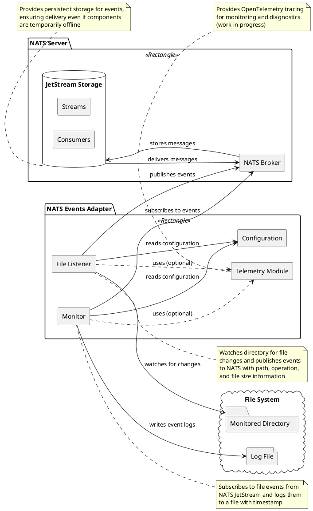
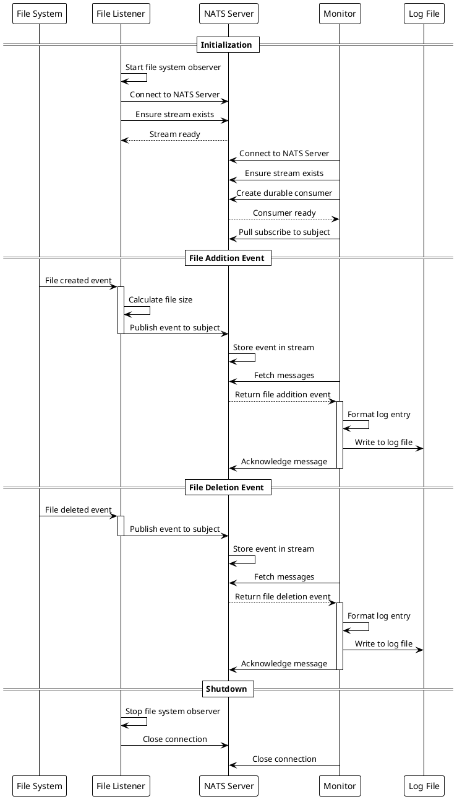
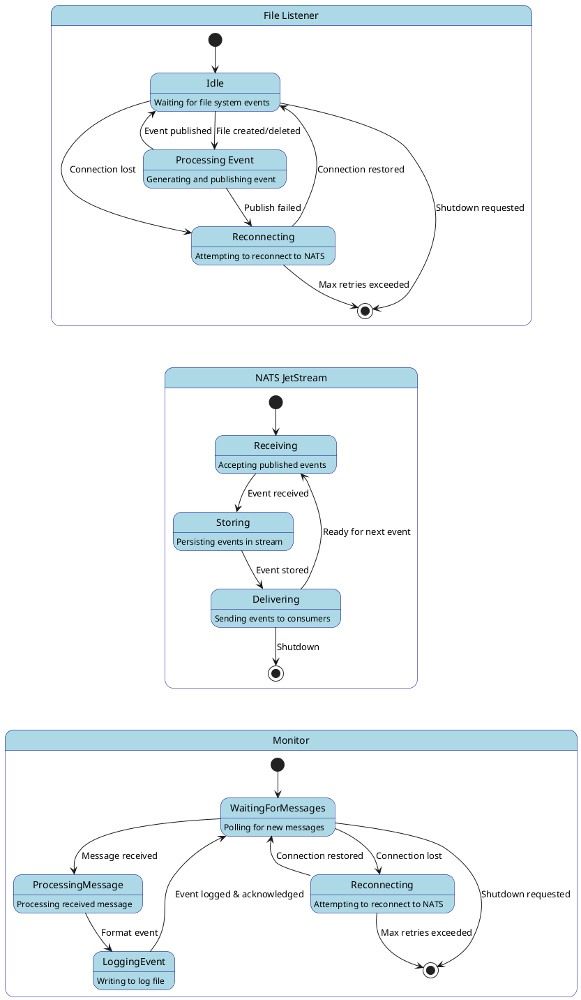
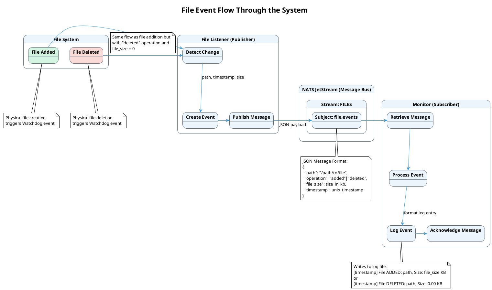
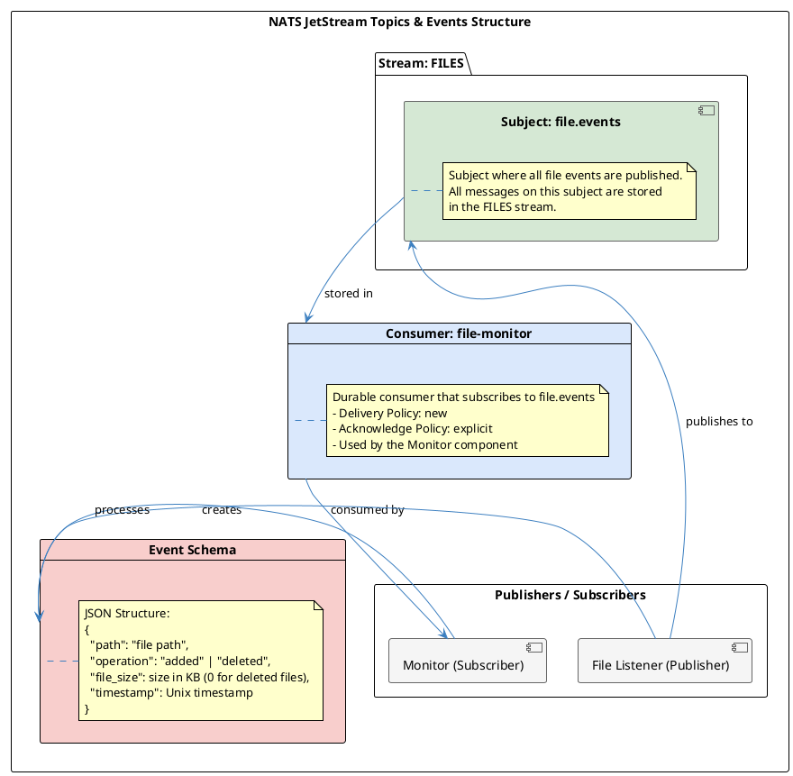

# NATS Events Adapter - Design Document

## 1. Introduction

The NATS Events Adapter is a proof-of-concept (PoC) system demonstrating integration with NATS server using JetStream persistence and management capabilities. This project showcases a practical implementation of the publish-subscribe pattern using NATS JetStream for reliable message delivery, persistence, and recovery.

### 1.1 Purpose

This PoC demonstrates several key capabilities:

1. **Event-Driven Architecture**: Shows how to implement a loosely coupled system where components communicate through events.
2. **Message Persistence**: Utilizes NATS JetStream for reliable message storage and delivery.
3. **Resilient Communication**: Handles connection issues and ensures no events are lost.
4. **Management Utilities**: Provides tools for monitoring and inspecting the message flow.
5. **Cross-Platform Compatibility**: Works on Windows and Linux environments.

### 1.2 Overview

The system monitors a directory for file changes (additions and deletions) and logs these events. This simple use case demonstrates the power of a message-based architecture by:

- Decoupling the file monitoring component from the logging component
- Ensuring reliable delivery of events even if components are temporarily offline
- Providing persistent storage and replay capabilities for events
- Offering monitoring and inspection tools for operational visibility

## 2. Component Model

The NATS Events Adapter follows a modular design with clearly separated components that interact through NATS messaging.

### 2.1 Component Architecture



The component diagram illustrates the major components of the system:

- **File Listener**: Monitors a specified directory for file changes and publishes events to NATS.
- **Monitor**: Subscribes to events from NATS and logs them to a file.
- **Configuration**: Centralized configuration module shared between components.
- **NATS Broker**: The NATS server that handles message routing.
- **JetStream Storage**: Persistent storage for messages, including streams and consumers.
- **Telemetry Module**: Optional OpenTelemetry integration for tracing and monitoring.

Each component has a well-defined responsibility, allowing for:

- **Independent Scaling**: Components can be deployed and scaled independently.
- **Technology Flexibility**: Components can be implemented in different languages if needed.
- **Resilience**: Failure in one component doesn't bring down the entire system.
- **Observability**: Each component can be monitored independently.

### 2.2 Sequence Diagram



The sequence diagram shows the interaction flow between components:

1. **Initialization Phase**:
   - Both the File Listener and Monitor connect to the NATS server
   - They ensure the required stream exists
   - The Monitor sets up a durable consumer and subscribes to the subject

2. **File Addition Event**:
   - When a file is created, the File Listener calculates its size
   - It publishes an event to the NATS subject
   - NATS stores the event in the stream
   - The Monitor fetches the message, formats it, writes to the log file, and acknowledges receipt

3. **File Deletion Event**:
   - Similar flow to the addition event, but no file size calculation is needed
   - The event is published, stored, fetched, logged, and acknowledged

4. **Shutdown**:
   - Components stop their activities and close connections gracefully

This interaction pattern demonstrates:
- **Asynchronous Communication**: Components don't need to be active simultaneously
- **Guaranteed Delivery**: Events are stored until successfully processed
- **Acknowledgment-Based Processing**: Ensures events are only marked as processed after successful handling

### 2.3 Components State Flow



The state diagram illustrates the lifecycle and state transitions of each component:

#### File Listener States:
- **Idle**: Waiting for file system events
- **Processing Event**: Generating and publishing an event
- **Reconnecting**: Attempting to reconnect to NATS after connection loss

#### NATS JetStream States:
- **Receiving**: Accepting published events
- **Storing**: Persisting events in the stream
- **Delivering**: Sending events to consumers

#### Monitor States:
- **Waiting for Messages**: Polling for new messages
- **Processing Message**: Handling a received message
- **Logging Event**: Writing event data to the log file
- **Reconnecting**: Attempting to reconnect to NATS after connection loss

The state transitions show the resilience mechanisms built into the system:
- Components attempt to reconnect when connections are lost
- Processing continues from where it left off after reconnection
- Graceful shutdown paths ensure clean termination

## 3. Events Flow

The Events Flow describes how file system events propagate through the system, from detection to logging, including the state transitions triggered by each event type.

### 3.1 Publisher/Subscriber Event Flow



The diagram above illustrates the end-to-end flow of events through the system, from the initial file system event to the final logging operation. It shows how events are processed, transformed, and passed between components.

### 3.2 Event Types and Processing

The system handles two primary event types:

| Event Type   | Trigger                | Publisher      | Consumer | Event Payload                                | Result                           |
|--------------|------------------------|----------------|----------|---------------------------------------------|----------------------------------|
| File Added   | File creation detected by Watchdog | File Listener  | Monitor  | `{"path": "...", "operation": "added", "file_size": size, "timestamp": time}` | Log entry: "[timestamp] File ADDED: path, Size: file_size KB" |
| File Deleted | File deletion detected by Watchdog | File Listener  | Monitor  | `{"path": "...", "operation": "deleted", "file_size": 0, "timestamp": time}`  | Log entry: "[timestamp] File DELETED: path, Size: 0.00 KB" |

### 3.3 Event Flow Explanation

1. **File Added Event Flow**:
   - The file system creates a new file in the monitored directory
   - Watchdog library detects the file creation and triggers an event
   - File Listener captures this event and calculates the file's size
   - File Listener creates a JSON event with "added" operation, path, size, and timestamp
   - The event is published to the "file.events" subject in NATS
   - NATS stores the event in the FILES stream for persistence
   - Monitor retrieves the message from its subscription
   - Monitor processes the event data and formats a log entry
   - Monitor writes the entry to the log file
   - Monitor acknowledges receipt of the message to NATS

2. **File Deleted Event Flow**:
   - The file system deletes a file from the monitored directory
   - Watchdog library detects the file deletion and triggers an event
   - File Listener captures this event (no size calculation needed)
   - File Listener creates a JSON event with "deleted" operation, path, zero size, and timestamp
   - The remaining flow is identical to the File Added event
   
This event-driven approach provides several advantages:
- **Decoupling**: The file system monitoring is completely separated from the logging
- **Persistence**: Events are stored in NATS JetStream until successfully processed
- **Resilience**: If the Monitor is offline, events will be delivered when it reconnects
- **Extensibility**: Additional subscribers can be added to process events differently

## 4. Topics and Events Schema

### 4.1 NATS Subjects and Streams



In NATS terminology:
- **Subjects** are channels where messages are published
- **Streams** are persistent storage for messages published to subjects
- **Consumers** are endpoints that read messages from streams

The diagram illustrates:
- A single stream named "FILES" that stores messages
- A subject "file.events" where all file events are published
- A consumer "file-monitor" that reads from the stream
- The File Listener as the publisher
- The Monitor as the subscriber
- The event schema used for communication

### 4.2 Stream Configuration

The FILES stream is configured with:
- **Subject filter**: file.events
- **Storage type**: File (for persistence)
- **Retention policy**: Limits (configurable message count/size limits)
- **Discard policy**: Old (oldest messages discarded first when limits are reached)

### 4.3 Consumer Configuration

The file-monitor consumer is configured with:
- **Durable name**: file-monitor (for persistent subscription state)
- **Delivery policy**: New (only new messages after subscription)
- **Acknowledgment policy**: Explicit (requires explicit acknowledgment)
- **Max deliver**: -1 (unlimited redelivery attempts)

### 4.4 Event Schema

All events follow a consistent JSON structure:

```json
{
  "path": "file path",
  "operation": "added" | "deleted",
  "file_size": size in KB (0 for deleted files),
  "timestamp": Unix timestamp
}
```

Where:
- **path**: The absolute path to the file
- **operation**: Either "added" (file creation) or "deleted" (file deletion)
- **file_size**: Size of the file in kilobytes (0 for deleted files)
- **timestamp**: Unix timestamp when the event occurred

### 4.5 Publishers and Subscribers

**Publishers**:
- **File Listener**: The sole publisher in this system
  - Creates events when files are added or deleted
  - Publishes to the "file.events" subject

**Subscribers**:
- **Monitor**: The primary subscriber
  - Uses a durable consumer for reliable message consumption
  - Processes events by logging them to a file
  - Acknowledges messages after successful processing

The relationship between publishers and subscribers is completely decoupled:
- They have no direct knowledge of each other
- They can operate independently and at different times
- Multiple subscribers could be added without changing the publisher
- Multiple publishers could publish to the same subject

## 5. Implementation Details

### 5.1 File Listener Component

The File Listener monitors a directory for file changes using the Watchdog library. Key features include:

- **File System Monitoring**: Uses Watchdog's FileSystemEventHandler
- **Event Publishing**: Publishes file events to NATS
- **Resilient Connection**: Implements reconnection logic
- **Graceful Shutdown**: Properly closes resources on exit

### 5.2 Monitor Component

The Monitor subscribes to file events and logs them. Key features include:

- **Durable Subscription**: Maintains subscription state even when offline
- **Explicit Acknowledgment**: Only acknowledges messages after successful processing
- **Resilient Connection**: Implements reconnection logic
- **Structured Logging**: Formats events into consistent log entries

### 5.3 Management Utilities

The `inspect_events.bat` script provides several commands for monitoring and managing the NATS environment:

- **stream**: View stream information and statistics
- **messages**: View all messages in a stream
- **consumer**: View consumer information and statistics
- **watch**: Watch for new messages in real-time
- **connections**: List all active connections
- **monitor**: Open the HTTP monitoring interface

### 5.4 Telemetry Integration

The optional Telemetry module provides:

- **Distributed Tracing**: Using OpenTelemetry standards
- **Span Creation**: For operation monitoring and diagnostics
- **Error Tracking**: Records exceptions in trace spans
- **Decorators**: For easy integration with existing code

## 6. Conclusion

The NATS Events Adapter demonstrates a practical implementation of an event-driven architecture using NATS JetStream. It showcases:

- **Loose Coupling**: Components interact only through messages
- **Resilience**: The system handles failures gracefully
- **Persistence**: Events are reliably stored and delivered
- **Observability**: Built-in tools for monitoring the system state

This design allows for:
- **Extensibility**: New components can be added without modifying existing ones
- **Maintainability**: Components can be updated independently
- **Scalability**: Components can be scaled based on workload demands
- **Reliability**: Events won't be lost even during component failures

As a proof of concept, this project provides a foundation that can be extended for more complex event processing scenarios and integrated with larger systems.